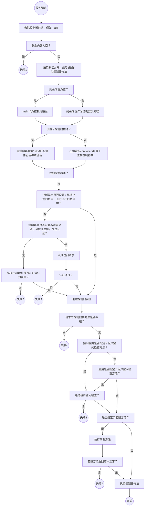
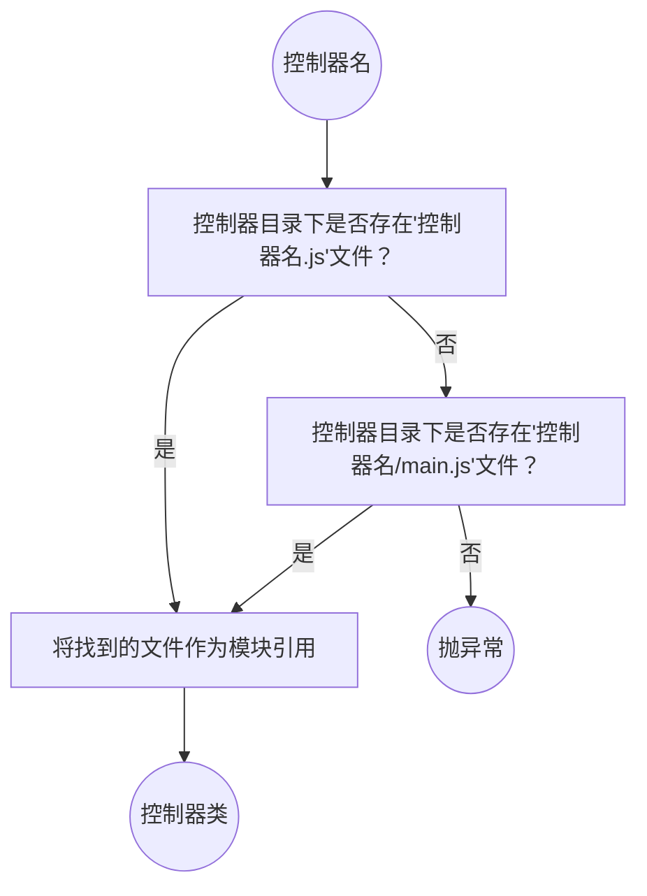
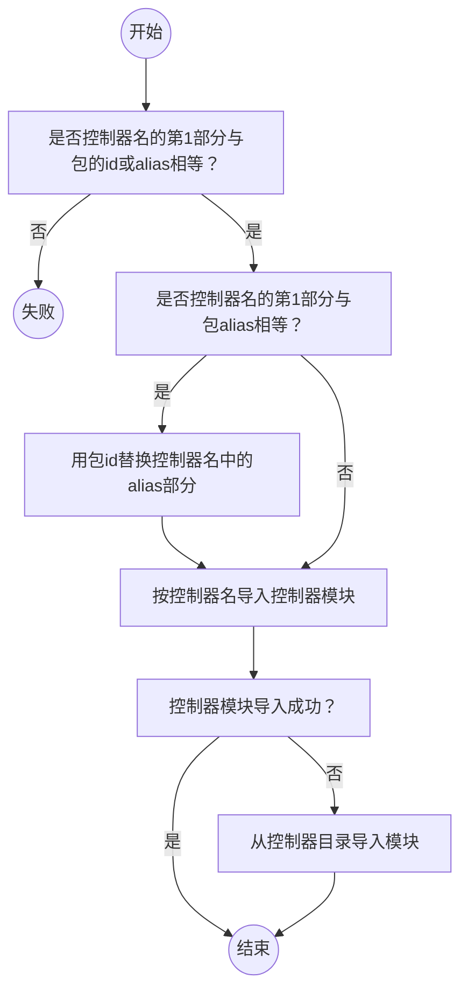

# 路由（router）

`controllers`的`prefix` 在 url 中出现，例如：`http://localhost:3001/api/tryGet?value=hello`，但是不在 controller 的路径中出现，例如：controllers/main.js 为与 url 对应的控制器。

控制器的默认实现为`main.js`

参考：https://www.npmjs.com/package/koa-router

在控制器类（Ctrl）中添加方法，说明需要在调用接口前执行的代码。

```javascript
async tmsBeforeEach(method) {
  // 返回ResultFault及其子类的对象，终止接口调用
  // return new ResultFault('发生错误')

  return true
}
```

控制器类（Ctrl）中添加方法，说明需要跳过认证检查的方法列表。

```javascript
static tmsAccessWhite() {
  // 不要进行认证检查的方法名列表
  return []
}
```

# 控制器（API）

项目根目录下创建`controllers`目录，路径和 url 匹配

需要从 Ctrl 类继承。

```javascript
const { Ctrl, ResultData } = require('tms-koa')

class Main extends Ctrl {
  tmsRequireTransaction() {
    return {
      get: true,
    }
  }
  get() {
    return new ResultData('I am an api.')
  }
}
module.exports = Main
```

`typescript`支持全量导出或默认导出

```ts
export default Xxx
```

```ts
export = Xxx
```

# 请求映射到控制器及方法



返回的是控制器 class，或者，返回的是模块，模块的默认导出是控制器 class。

`new`创建控制的实例，传递 5 个参数，依次为：`ctx`，`tmsClient`，`dbContext`，`mongoClient `和`pushContext`。

在创建的实例上检查要调用的控制器方法是否存在，若不存在报错。

若控制器上提供了`tmsBucketValidator`方法，则调用该方法检查是否满足多租户规则。否则，若，应用配置了`checkClientBucket`方法，则调用检查多租户规则。

若检查不通过，终止执行，返回错误信息。若通过，给控制器实例`bucket`赋值。

在控制类上执行方法，传入参数`request`参数。

若控制器上存在`tmsBeforeEach`静态方法，则执行该方法，若返回`ResultData`类型，停止执行，返回失败结果。

# 本地查找控制器类



# npm 包中查找控制器类

应用配置（config/app.js）中可指定`npm`包作为控制器插件。控制器路径的第 1 部分作为包名称（id）或包的别名（alias）。如果是别名匹配，用包名称替代别名。在包中查找匹配的类。


